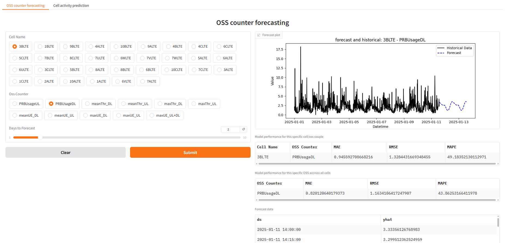

# Network Performance Prediction System📡

This repository is designed to build a network performance prediction system based 
on data from the [Kaggle competition](https://www.kaggle.com/c/anomaly-detection-in-4g-cellular-networks/overview). 
A gradio application that allows interacting with the system is also built.

The dataset, organized row-wise, contains measurements from **33 LTE 4G cells**, with each cell characterized
by **11 OSS counters** related to **PRB usage**, **throughput**, and the **number of connected user equipment devices**.

In addition to OSS counters, each row includes:
- The **cell name**
- A **timestamp** (e.g., `"07:15"`)
- A **label** indicating whether the cell’s activity at that time is **"usual"** or **"unusual"**

The data is recorded at **15-minute intervals**.
## Approach
We developed two types of models to build the prediction system:
1. Time series forecasting model:  
   Using **Prophet** to forecast OSS counters based on historical trends. In this step, each couple of **(cell, oss counter) has its own model**.
2. Classification model:  
   Predicting whether a given set of OSS counter values corresponds to **usual** or **unusual** activity.

## Gradio Dashboard Output
Here is the expected gradio dashboard :


## Project Structure

- `src/` – source code for preprocessing, modeling, evaluation and building a Gradio application.
- `models/` – saved trained models (oss counters forecasting models and classifier performance degradation).
- `tests/` – unit tests for validation.
- `experimental/` – **experimental notebooks that you can consult to check the outcome of the data processing step and the forecastings**.
- `configuration.ini` – configuration file used during launch.
- `Dockerfile` – docker file.
- `requirements.txt` – python packages.

## 🚀 Launch and test the app on your Local Machine

1. Clone the repository

```bash
git clone https://github.com/mahmoudalbardan/NetworkPerformanceAnalysis.git
cd NetworkPerformanceAnalysis
pip install -r requirements.txt
```

2. *Optional: Run the training scripts (might be slow due to the grid search cv) and tests (the models are already trained and saved in the repository);  
You can add the test run command into your .yml file if you want to build CI/CD pipeline*.
```bash
python -m unittest discover -s tests 
python src/network_activity_classification.py --configuration configuration.ini 
python src/oss_counters_forecasting.py --configuration configuration.ini 
```
The network activity classification model will be automatically saved at `models/network_activity_classifier.pkl`, 
while the OSS counter forecasting models will be stored individually under
`models/oss_counters_forecasting_models/`, following the name `prophet_{cell_name}_{oss_counter}.pkl`

3. Build docker image
```bash
docker build -t networkapp .
```
4.  Run docker container
```bash
docker run -p 7860:7860 networkapp
```
5. Open [localhost](http://127.0.0.1:7860) in your browser and test the gradio app ! 
(when you are working under the *Cell activity prediction* tab, you have to upload the test file `data/test.csv`)
